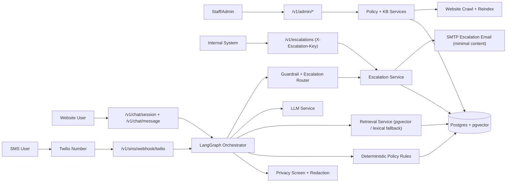
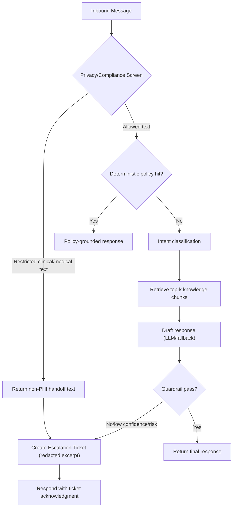
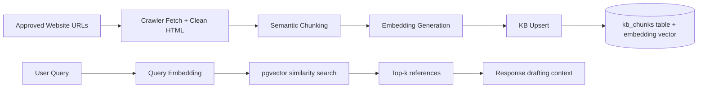
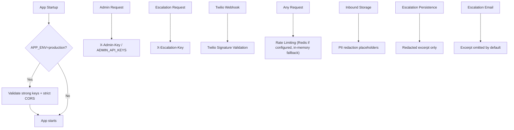

# Phase 1 Architecture Visual (Non-PHI)

Last updated: 2026-03-01

## 1) End-to-End System View

## 2) AI/Logic Decision Path

## 3) Retrieval + Knowledge Pipeline

## 4) Security and Hardening Controls (Phase 1)

## 5) Key API Surface (Current)
1. `GET /v1/health`
2. `GET /v1/metrics`
3. `POST /v1/chat/session`
4. `POST /v1/chat/message`
5. `POST /v1/sms/webhook/twilio`
6. `POST /v1/voice/webhook/twilio`
7. `POST /v1/escalations` (requires `X-Escalation-Key`)
8. `POST /v1/admin/policy` (requires `X-Admin-Key`)
9. `POST /v1/admin/kb/reindex` (requires `X-Admin-Key`)
10. `POST /v1/admin/kb/approve` (requires `X-Admin-Key`)
11. `POST /v1/admin/privacy/retention-run` (requires `X-Admin-Key`)

## 6) Quick Operator Mental Model
1. Policy facts answer first.
2. AI answers only where allowed and useful.
3. Risk/uncertainty routes to human escalation.
4. Stored and emailed escalation content is minimized.
5. Production startup blocks unsafe default secrets/config.
